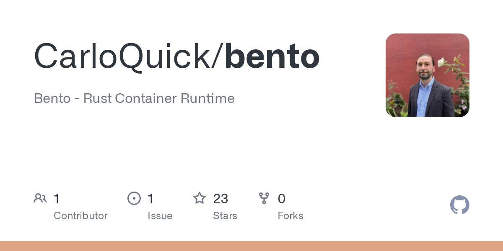
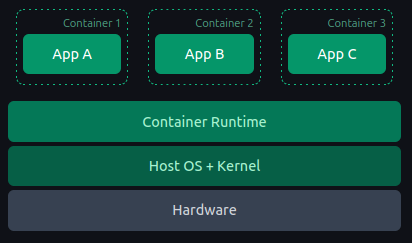
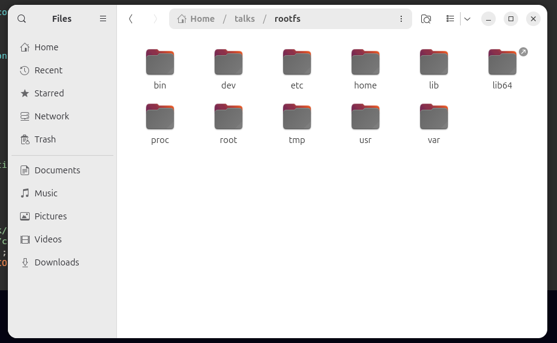

---
theme:
  override:
    code:
      alignment: left
      background: true
title: "Building a Minimal, Rootless Container in Rust"
author: Carlo Quick
---
bento
===

<!-- end_slide -->
Talk Goal
===
<!-- font_size: 2 -->
By the end of this talk, you'll have:
* A mental model of container fundamentals
* Rust tools to build your own
* A sense of why Rust makes the Linux kernel approachable

<!-- end_slide -->
isolation
===
<!-- column_layout: [1, 1] -->
<!-- pause -->
<!-- column: 0 -->

<!-- font_size: 2 -->
* **Virtual Machines**: machine-level isolation.
<!-- pause -->
<!-- column: 1 -->

* **Containers**: process-level isolation.

<!-- end_slide -->
Namespaces and Cgroups
===

<!-- column_layout: [1, 1] -->
<!-- column: 0 -->
<!-- pause -->
<!-- font_size: 2 -->
# Namespaces

- control what a process can **see**.

<!-- pause -->
<!-- column: 1 -->

# Cgroups
- control what a process can **use**.

<!-- pause -->
<!-- reset_layout -->
<!-- new_lines: 2 -->
**Namespaces** give a process its own view of things like PIDs, hostnames, and filesystems. **Cgroups** keep it from eating all your CPU and memory.

Today, we're focusing entirely on **namespaces**. Cgroups are important — but that's a whole other talk.
<!-- end_slide -->

Namespaces
===
# Each process has a /proc/[pid]/ns subdirectory for its namespaces.
* PID
* Network (network stack)
* Mount (fs mount point)
* UTS (hostname and system identifier)
* IPC (inter-process communication)
* User (user and group id)
* Cgroup
<!-- alignment: center -->

_Each symlink points to the namespace instance the process currently belongs to._
<!-- end_slide -->
<!-- skip_slide -->
Namespaces
===
<!-- alignment: center -->
| Namespace | Flag | Page | Isolates | 
|:---|:---|:---|:---|
| Cgroup |CLONE_NEWCGROUP |cgroup_namespaces(7) |  Cgroup root directory |
| IPC | CLONE_NEWIPC | ipc_namespaces(7) |System V IPC, POSIX message queues |
| Network | CLONE_NEWNET | network_namespaces(7) | Network devices,stacks,ports, etc. |
| Mount | CLONE_NEWNS | mount_namespaces(7) | Mount points |
| PID | CLONE_NEWPID | pid_namespaces(7) | Process IDs |
| Time | CLONE_NEWTIME | time_namespaces(7) | Boot and monotonic clocks |
| User | CLONE_NEWUSER | user_namespaces(7) | User and group IDs |
| UTS | CLONE_NEWUTS | uts_namespaces(7) | Hostname and NIS domain name |


<!-- end_slide -->
<!-- skip_slide -->
Container vs Host's Perspective
===
<!-- column_layout: [1, 1] -->
<!-- column: 0 -->
<!-- alignment: center -->
<!-- font_size: 2 -->
**Container's View**

"I'm the whole machine"

* PID:  1
👑 I am alone!


<!-- column: 1 -->
<!-- alignment: center -->
**Host's View**

* PID 1     systemd
* PID 435   sshd
* PID 1200  nginx
* PID 4812  "container"  ←
* PID 4999  postgres
...

<!-- end_slide -->

the root problem
===
<!-- font_size: 2 -->
A **container** is a process with a restricted view of the system.
<!-- new_lines: 1 -->
<!-- pause -->
What privileges does that process actually have?
<!-- pause -->
<!-- new_lines: 1 -->
<!-- alignment: center -->
```bash
$ docker run --rm alpine whoami
root
```
<!-- pause -->
🚨 By default, the Docker engine runs containers as **root**.

Docker does support rootless mode — but it requires additional configuration.
<!-- pause -->

<!-- end_slide -->

Rootless Containers
===
<!-- font_size: 2 -->
Rootless containers run as an unprivileged user — no root required.

<!-- pause -->

If the process escapes isolation, it's still just **you** on the host.

<!-- pause -->
<!-- alignment: center -->

<!-- new_lines: 1 -->

_Smaller blast radius. Safer by default._

<!-- end_slide -->
Rust + exploring Linux kernel = ❤️
===
<!-- font_size: 2 -->
<!-- pause -->
# Rust doesn't invent new container primitives. It doesn't replace syscalls.

🦀
<!-- pause -->
# It gives you **compiler-enforced honesty**!
<!-- pause -->
* Fallible operation returns a `Result`
* Unsafe operation is explicitly marked
* Boundaries between safe and dangerous are **visible in the code**

The language refuses to let you gloss over the hard parts.
<!-- end_slide -->

fork(): C vs. Rust
===
* `fork()` creates a new process by duplicating the calling process. The new process is referred to as the child process.
<!-- column_layout: [1, 1] -->
<!-- column: 0 -->
```c
// C — fork(2)
pid = fork();
switch (pid) {
    case -1:
        perror("fork");
        exit(EXIT_FAILURE);
    case 0:
        puts("Child exiting.");
        _exit(EXIT_SUCCESS);
    default:
        printf("Child is PID %jd\n",
               (intmax_t) pid);
        exit(EXIT_SUCCESS);
}
```
* Returns `-1`, `0`, or a PID — you check manually
* Errors surface via `errno`, not the return value
* Nothing stops you from ignoring the error case

<!-- column: 1 -->
```rust
// Rust — nix::unistd::fork
match unsafe { fork() } {
    Ok(Parent { child, .. }) => {
        println!("Child PID {}", child);
        waitpid(child, None)?;
    }
    Ok(Child) => {
        write(stdout(),
        b"Child process\n").ok();
        unsafe { libc::_exit(0) };
    }
    Err(_) => bail!("Fork failed."),
}
```
* Returns a `Result<ForkResult>` — exhaustive by design
* The compiler requires you handle `Parent`, `Child`, and `Err`
* `unsafe` is explicit — the danger is visible, not hidden
<!-- end_slide -->
The Tools (nix crate)
===

The **nix** crate wraps low-level libc calls in idiomatic Rust — not by hiding danger, but by making it explicit in the type system.

<!-- pause -->
**_https://github.com/nix-rust/nix_**

<!-- column_layout: [1, 1] -->
<!-- column: 0 -->

**libc**

```c
// unsafe, manual errno handling
pub unsafe extern fn gethostname(
    name: *mut c_char,
    len: size_t
) -> c_int;
```

<!-- column: 1 -->

**nix**

```rust
// returns Result<OsString>
pub fn gethostname() -> Result<OsString>;
```

<!-- reset_layout -->

<!-- pause -->

The kernel is still the kernel. But the **boundary is visible**: this can fail, and you must handle it.

<!-- pause -->

Let's start building.

<!-- end_slide -->

Guided Build
===
> **Note**: This demonstration is Linux kernel specific. I will share the slides and github link at the end of the presentation if anyone would like to try it themselves. Remember, though, you'll need to be on a linux machine, linux vm, use wsl2, or in container with special privileges.

These are the only dependencies, that we'll need!

```toml
[dependencies]
anyhow = "1.0.100"
nix = { version = "0.30.1", features = ["sched", "feature", "fs", "mount", "process", "hostname", "signal","user"] }
```

The hardened kernel in Ubuntu 23.10+ restricts unprivileged user namespaces via AppArmor. When trying to make your container rootless, the kernel will prevent it. Follow this post to learn more about it.
running `echo 0 | sudo tee /proc/sys/kernel/apparmor_restrict_unprivileged_userns` will allow modifying user namespaces until the next system restart.

[AppArmor: Restrict Unprivileged User Namespaces](https://ubuntu.com/blog/ubuntu-23-10-restricted-unprivileged-user-namespaces)

<!-- end_slide -->

Printing Process Information
===

```rust
use nix::unistd::{ getcwd, gethostname, getpid, getuid };
fn print_proc_info(label: &str) -> Result<()> {
    eprintln!("[{}]", label);
    eprintln!(
        "uid [{}]\n\thostname [{:?}]  \n\tpid [{}] \n\tcwd [{:?}]",
        getuid(),
        gethostname()?,
        getpid(),
        getcwd()?,
    );
    Ok(())
}
```

For the sake of simplicity, I won't be showing this print function, but it works behind the scenes to provide an accurate view of the process' current state.

<!-- end_slide -->

build roadmap
===
<!-- font_size: 2 -->
<!-- alignment: center -->

<!-- new_lines: 2 -->

* ⬜ Rootless — run without root privileges
* ⬜ Isolated Hostname — separate UTS namespace
* ⬜ PID 1 — believe it's the only process
* ⬜ Isolated root filesystem — its own `/`

<!-- end_slide -->
Process Baseline
===
<!-- column_layout: [1, 1] -->


<!-- column: 0 -->
````rust +exec:rust-script +id:process_baseline
# //! ```cargo
# //! [dependencies]
# //! anyhow = "1.0.100"
# //! nix = { version = "0.30.1", features = ["sched", "fs", "mount", "process", "hostname", "signal","user"] }
# //! ```
# use anyhow::Result;
# use nix::unistd::{ getcwd, gethostname, getpid, getuid };
# fn print_proc_info(label: &str) -> Result<()> {
#    eprintln!("[{}]", label);
#    eprintln!(
#        "uid [{}]\n\thostname [{:?}]  \n\tpid [{}] \n\tcwd [{:?}]",
#        getuid(),
#        gethostname()?,
#        getpid(),
#        getcwd()?,
#    );
#    Ok(())
# }
fn main() -> Result<()> {
    print_proc_info("Before Isolation")?;
    Ok(())
}
````
* A snapshot of the process before any isolation is applied
* uid, hostname, pid, and cwd — our reference point for what changes
<!-- column: 1 -->
<!-- snippet_output: process_baseline -->

<!-- end_slide -->

trying to do something container-y
===
<!-- column_layout: [3, 2] -->


<!-- column: 0 -->
````rust +exec:rust-script +id:containery
# //! ```cargo
# //! [dependencies]
# //! anyhow = "1.0.100"
# //! nix = { version = "0.30.1", features = ["sched", "fs", "mount", "process", "hostname", "signal","user"] }
# //! ```
use anyhow::{Context, Result};
use nix::unistd::{ getcwd, gethostname, getpid, getuid, sethostname };
# fn print_proc_info(label: &str) -> Result<()> {
#    eprintln!("[{}]", label);
#    eprintln!(
#        "uid [{}]\n\thostname [{:?}]  \n\tpid [{}] \n\tcwd [{:?}]",
#        getuid(),
#        gethostname()?,
#        getpid(),
#        getcwd()?,
#    );
#    Ok(())
# }

fn main() -> Result<()> {
    print_proc_info("Before Isolation")?;
    sethostname("my-container").context("Failed to set container hostname")?;
    print_proc_info("After Isolation")?;
    Ok(())
}
````
* `sethostname` without a namespace — the hostname change affects the whole host
* The output will show why this approach is a problem
<!-- column: 1 -->
<!-- snippet_output: containery -->

<!-- end_slide -->
unshare
===

# unshare(2)
"disassociate parts of the process execution context"

<!-- pause -->
It takes a flag argument that specifies which parts of the process' execution should be "unshared".

For today's talk, we'll only be using:

<!-- incremental_lists: true -->

- CloneFlags::CLONE_NEWUSER - new user namespace
- CloneFlags::CLONE_NEWUTS - new uts (hostname) namespace
- CloneFlags::CLONE_NEWPID - new pid namespace
- CloneFlags::CLONE_NEWNS - new mount namespace

<!-- end_slide -->

unshare the uts namespace — uh oh
===

<!-- column_layout: [3, 2] -->


<!-- column: 0 -->
````rust +exec:rust-script +id:failed_unshare_uts
# //! ```cargo
# //! [dependencies]
# //! anyhow = "1.0.100"
# //! nix = { version = "0.30.1", features = ["sched", "fs", "mount", "process", "hostname", "signal","user"] }
# //! ```
use anyhow::{Context, Result};
use nix::{
    sched::{CloneFlags, unshare},
    unistd::{ getcwd, gethostname, getpid, getuid, sethostname }
};
# fn print_proc_info(label: &str) -> Result<()> {
#    eprintln!("[{}]", label);
#    eprintln!(
#        "uid [{}]\n\thostname [{:?}]  \n\tpid [{}] \n\tcwd [{:?}]",
#        getuid(),
#        gethostname()?,
#        getpid(),
#        getcwd()?,
#    );
#    Ok(())
# }

fn main() -> Result<()> {
    print_proc_info("Before Isolation")?;

    // === UTS NAMESPACE ===
    unshare(CloneFlags::CLONE_NEWUTS).context("Failed to isolate uts namespace")?;
    sethostname("my-container")?;

    print_proc_info("After Isolation")?;
    Ok(())
}
````
* We added `unshare(CLONE_NEWUTS)` — but the output shows a permissions error
* Unprivileged users can't create namespaces without a user namespace first
<!-- column: 1 -->
<!-- snippet_output: failed_unshare_uts -->
<!-- end_slide -->
goin' rootless
===
```rust
fn write_proc_mappings(uid_map: &str, gid_map: &str) -> Result<()> {
    std::fs::write("/proc/self/uid_map", uid_map).context("Failed to write to uid")?;
    // Writing `"deny"` disables the syscall setgroups() in the namespace, and then the kernel allows the `gid_map` write.
    std::fs::write("/proc/self/setgroups", "deny").context("Failed to write to gid setgroup")?;
    std::fs::write("/proc/self/gid_map", gid_map).context("Failed to write to gid")?;

    Ok(())
}
```
```rust
    // fn main() -- snip --

    // === USER NAMESPACE ===
    let uid_map = format!("0 {} 1", nix::unistd::getuid());
    let gid_map = format!("0 {} 1", nix::unistd::getgid());
    unshare(CloneFlags::CLONE_NEWUSER).context("Failed to isolate user namespace")?;
    write_proc_mappings(&uid_map, &gid_map)?;

    // -- snip --
```
**Why write to uid_map / gid_map?**

* The new user namespace has no idea who you are. These files tell the kernel:
* "UID 0 inside this namespace = your real host UID"

We appear as **root** inside the container — the host knows you're not.

_setgroups_ → deny is required by the kernel before it accepts the **gid_map** write, to prevent privilege escalation via group manipulation.

<!-- end_slide -->
(a little) isolation achieved!
===
<!-- column_layout: [3, 2] -->


<!-- column: 0 -->

````rust +exec:rust-script +id:kinda_isolation
# //! ```cargo
# //! [dependencies]
# //! anyhow = "1.0.100"
# //! nix = { version = "0.30.1", features = ["sched", "fs", "mount", "process", "hostname", "signal","user"] }
# //! ```
# use anyhow::{Context, Result};
# use nix::{
#    sched::{CloneFlags, unshare},
#    unistd::{ getcwd, gethostname, getpid, getuid, sethostname }
# };
# fn print_proc_info(label: &str) -> Result<()> {
#    eprintln!("[{}]", label);
#    eprintln!(
#        "uid [{}]\n\thostname [{:?}]  \n\tpid [{}] \n\tcwd [{:?}]",
#        getuid(),
#        gethostname()?,
#        getpid(),
#        getcwd()?,
#    );
#    Ok(())
# }
# fn write_proc_mappings(uid_map: &str, gid_map: &str) -> Result<()> {
#    std::fs::write("/proc/self/uid_map", uid_map).context("Failed to write to uid")?;
#    // Writing `"deny"` disables the syscall setgroups() in the namespace, and then the kernel allows the `gid_map` write.
#    std::fs::write("/proc/self/setgroups", "deny").context("Failed to write to gid setgroup")?;
#    std::fs::write("/proc/self/gid_map", gid_map).context("Failed to write to gid")?;
#    Ok(())
# }
fn main() -> Result<()> {
    print_proc_info("Before Isolation")?;
    // === USER NAMESPACE ===
    let uid_map = format!("0 {} 1", nix::unistd::getuid());
    let gid_map = format!("0 {} 1", nix::unistd::getgid());
    unshare(CloneFlags::CLONE_NEWUSER).context("Failed to isolate user namespace")?;
    write_proc_mappings(&uid_map, &gid_map)?;

    // === UTS NAMESPACE ===
    unshare(CloneFlags::CLONE_NEWUTS).context("Failed to isolate uts namespace")?;
    sethostname("my-container")?;
    print_proc_info("After Isolation")?;
    Ok(())
}
````
* User namespace first — unlocks the ability to create other namespaces without root
* UTS namespace isolates the hostname — the host is unaffected
<!-- column: 1 -->
<!-- snippet_output: kinda_isolation -->
<!-- reset_layout -->


<!-- pause -->
How about on the host?
```bash +exec
hostname
```

<!-- end_slide -->

build roadmap
===
<!-- font_size: 2 -->
<!-- alignment: center -->

<!-- new_lines: 2 -->

* ✅ Rootless — run without root privileges
* ✅ Isolated Hostname — separate UTS namespace
* ⬜ PID 1 — believe it's the only process
* ⬜ Isolated root filesystem — its own `/`

<!-- end_slide -->
pid namespace
===
<!-- column_layout: [3, 2] -->


<!-- column: 0 -->

````rust +exec:rust-script +id:not_desired_pid_result
# //! ```cargo
# //! [dependencies]
# //! anyhow = "1.0.100"
# //! nix = { version = "0.30.1", features = ["sched", "fs", "mount", "process", "hostname", "signal","user"] }
# //! ```
# use anyhow::{Context, Result};
# use nix::{
#    sched::{CloneFlags, unshare},
#    unistd::{ getcwd, gethostname, getpid, getuid, sethostname }
# };
# fn print_proc_info(label: &str) -> Result<()> {
#    eprintln!("[{}]", label);
#    eprintln!(
#        "uid [{}]\n\thostname [{:?}]  \n\tpid [{}] \n\tcwd [{:?}]",
#        getuid(),
#        gethostname()?,
#        getpid(),
#        getcwd()?,
#    );
#    Ok(())
# }
# fn write_proc_mappings(uid_map: &str, gid_map: &str) -> Result<()> {
#    std::fs::write("/proc/self/uid_map", uid_map).context("Failed to write to uid")?;
#    // Writing `"deny"` disables the syscall setgroups() in the namespace, and then the kernel allows the `gid_map` write.
#    std::fs::write("/proc/self/setgroups", "deny").context("Failed to write to gid setgroup")?;
#    std::fs::write("/proc/self/gid_map", gid_map).context("Failed to write to gid")?;
#    Ok(())
# }
fn main() -> Result<()> {
  print_proc_info("Before Isolation")?;
  // === USER NAMESPACE ===
  let uid_map = format!("0 {} 1", nix::unistd::getuid());
  let gid_map = format!("0 {} 1", nix::unistd::getgid());
  unshare(CloneFlags::CLONE_NEWUSER).context("Failed to isolate user namespace")?;
  write_proc_mappings(&uid_map, &gid_map)?;
  // === UTS NAMESPACE ===
  unshare(CloneFlags::CLONE_NEWUTS).context("Failed to isolate uts namespace")?;
  sethostname("my-container")?;
  // === PID NAMESPACE - next forked child will be PID 1 ===
  unshare(CloneFlags::CLONE_NEWPID).context("Failed to isolate PID namespace")?;
  print_proc_info("After Isolation")?;
  Ok(())
}
````
* `CLONE_NEWPID` is set — but the output still shows the original PID
* The new namespace only takes effect for the **next forked child**, not the current process

<!-- column: 1 -->
<!-- snippet_output: not_desired_pid_result -->
<!-- end_slide -->

unshare pid namespace + fork()
===

````rust
# //! ```cargo
# //! [dependencies]
# //! anyhow = "1.0.100"
# //! nix = { version = "0.30.1", features = ["sched", "fs", "mount", "process", "hostname", "signal","user"] }
# //! ```
# use anyhow::{Context, Result};
# use nix::{
#    sched::{CloneFlags, unshare},
#     sys::wait::waitpid,
#    unistd::{ ForkResult, getcwd, gethostname, getpid, getuid, sethostname, fork }
# };
# fn print_proc_info(label: &str) -> Result<()> {
#    eprintln!("[{}]", label);
#    eprintln!(
#        "uid [{}]\n\thostname [{:?}]  \n\tpid [{}] \n\tcwd [{:?}]",
#        getuid(),
#        gethostname()?,
#        getpid(),
#        getcwd()?,
#    );
#    Ok(())
# }
# fn write_proc_mappings(uid_map: &str, gid_map: &str) -> Result<()> {
#    std::fs::write("/proc/self/uid_map", uid_map).context("Failed to write to uid")?;
#    // Writing `"deny"` disables the syscall setgroups() in the namespace, and then the kernel allows the `gid_map` write.
#    std::fs::write("/proc/self/setgroups", "deny").context("Failed to write to gid setgroup")?;
#    std::fs::write("/proc/self/gid_map", gid_map).context("Failed to write to gid")?;
#    Ok(())
# }
# fn main() -> Result<()> {
#   print_proc_info("Before Isolation")?;
#   // === USER NAMESPACE ===
#   let uid_map = format!("0 {} 1", nix::unistd::getuid());
#   let gid_map = format!("0 {} 1", nix::unistd::getgid());
#   unshare(CloneFlags::CLONE_NEWUSER).context("Failed to create user namespace")?;
#   write_proc_mappings(&uid_map, &gid_map)?;

    // ↑↑ USER NAMESPACE Isolation ↑↑
    // === PID NAMESPACE - next forked child will be PID 1 ===
    unshare(CloneFlags::CLONE_NEWPID).context("Failed to isolate PID namespace")?;
    
    // fork() creates a child process by duplicating the parent
    match unsafe { fork() } {
        Ok(ForkResult::Parent { child }) => {
            // -- snip --
        }
        Ok(ForkResult::Child) => {
            // -- snip --
        }
        Err(err) => Err(err).context("fork() failed")?,
    }
#   Ok(())
# }
````
* `unshare(CLONE_NEWPID)` prepares the namespace — `fork()` is what activates it
* The parent waits, the child becomes PID 1 inside the new namespace
* `unsafe` is required — the compiler forces you to acknowledge the risk explicitly
<!-- end_slide -->

child()
===

````rust
# //! ```cargo
# //! [dependencies]
# //! anyhow = "1.0.100"
# //! nix = { version = "0.30.1", features = ["sched", "fs", "mount", "process", "hostname", "signal","user"] }
# //! ```
# use anyhow::{Context, Result};
# use nix::{
#    sched::{CloneFlags, unshare},
#     sys::wait::waitpid,
#    unistd::{ ForkResult, getcwd, gethostname, getpid, getuid, sethostname, fork }
# };
# fn print_proc_info(label: &str) -> Result<()> {
#    eprintln!("[{}]", label);
#    eprintln!(
#        "uid [{}]\n\thostname [{:?}]  \n\tpid [{}] \n\tcwd [{:?}]",
#        getuid(),
#        gethostname()?,
#        getpid(),
#        getcwd()?,
#    );
#    Ok(())
# }
# fn write_proc_mappings(uid_map: &str, gid_map: &str) -> Result<()> {
#    std::fs::write("/proc/self/uid_map", uid_map).context("Failed to write to uid")?;
#    // Writing `"deny"` disables the syscall setgroups() in the namespace, and then the kernel allows the `gid_map` write.
#    std::fs::write("/proc/self/setgroups", "deny").context("Failed to write to gid setgroup")?;
#    std::fs::write("/proc/self/gid_map", gid_map).context("Failed to write to gid")?;
#    Ok(())
# }
fn child() -> Result<()> {
    // === UTS NAMESPACE ===
    unshare(CloneFlags::CLONE_NEWUTS).context("Failed to isolate uts namespace")?;
    sethostname("my-container")?;

    print_proc_info("Child Isolation")?;
    Ok(())
}
fn main() -> Result<()> {
    // -- snip -- ↑↑ USER and PID NAMESPACE Isolation ↑↑
#   print_proc_info("Before Isolation")?;
#   // === USER NAMESPACE ===
#   let uid_map = format!("0 {} 1", nix::unistd::getuid());
#   let gid_map = format!("0 {} 1", nix::unistd::getgid());
#   unshare(CloneFlags::CLONE_NEWUSER).context("Failed to create user namespace")?;
#   write_proc_mappings(&uid_map, &gid_map)?;
#    // === PID NAMESPACE - next forked child will be PID 1 ===
#    unshare(CloneFlags::CLONE_NEWPID).context("Failed to create a PID namespace")?;    
#    // fork() creates a child process by duplicating the parent
    match unsafe { fork() } {
        Ok(ForkResult::Parent { child }) => {
            waitpid(child, None)?;
        }
        Ok(ForkResult::Child) => {
            child()?;
        }
        Err(err) => Err(err).context("fork() failed")?,
    }
   Ok(())
# }
````
* The forked child runs `child()` — isolation specific to the container happens here
* UTS namespace and hostname are set inside the child, keeping the host completely unaffected
* `main()` just waits — the parent's only job now is to wait for the child to finish
<!-- end_slide -->

forking a child process
===
<!-- column_layout: [3, 2] -->


<!-- column: 0 -->

````rust +exec:rust-script +id:forking_proc_child
# //! ```cargo
# //! [dependencies]
# //! anyhow = "1.0.100"
# //! nix = { version = "0.30.1", features = ["sched", "fs", "mount", "process", "hostname", "signal","user"] }
# //! ```
# use anyhow::{Context, Result};
# use nix::{
#    sched::{CloneFlags, unshare},
#     sys::wait::waitpid,
#    unistd::{ ForkResult, getcwd, gethostname, getpid, getuid, sethostname, fork }
# };
# fn print_proc_info(label: &str) -> Result<()> {
#    eprintln!("[{}]", label);
#    eprintln!(
#        "uid [{}]\n\thostname [{:?}]  \n\tpid [{}] \n\tcwd [{:?}]",
#        getuid(),
#        gethostname()?,
#        getpid(),
#        getcwd()?,
#    );
#    Ok(())
# }
# fn write_proc_mappings(uid_map: &str, gid_map: &str) -> Result<()> {
#    std::fs::write("/proc/self/uid_map", uid_map).context("Failed to write to uid")?;
#    // Writing `"deny"` disables the syscall setgroups() in the namespace, and then the kernel allows the `gid_map` write.
#    std::fs::write("/proc/self/setgroups", "deny").context("Failed to write to gid setgroup")?;
#    std::fs::write("/proc/self/gid_map", gid_map).context("Failed to write to gid")?;
#    Ok(())
# }
fn child() -> Result<()> {
    // === UTS NAMESPACE ===
    unshare(CloneFlags::CLONE_NEWUTS).context("Failed to isolate uts namespace")?;
    sethostname("my-container")?;

    print_proc_info("Child Isolation")?;
    Ok(())
}
fn main() -> Result<()> {
    print_proc_info("Before Isolation")?;
    // === USER NAMESPACE ===
    let uid_map = format!("0 {} 1", nix::unistd::getuid());
    let gid_map = format!("0 {} 1", nix::unistd::getgid());
    unshare(CloneFlags::CLONE_NEWUSER).context("Failed to create user namespace")?;
    write_proc_mappings(&uid_map, &gid_map)?;
    // === PID NAMESPACE - next forked child will be PID 1 ===
    unshare(CloneFlags::CLONE_NEWPID).context("Failed to isolate PID namespace")?;    
    // fork() creates a child process by duplicating the parent
    match unsafe { fork() } {
        Ok(ForkResult::Parent { child }) => {
            waitpid(child, None)?;
        }
        Ok(ForkResult::Child) => {
            child()?;
        }
        Err(err) => Err(err).context("fork() failed")?,
    }
   Ok(())
 }
````
* The full picture — user namespace, PID namespace, fork, and child isolation all together
* Check the output: uid is 0, hostname is `my-container`, PID is 1
<!-- column: 1 -->
<!-- snippet_output: forking_proc_child -->

<!-- end_slide -->

build roadmap
===
<!-- font_size: 2 -->
<!-- alignment: center -->

<!-- new_lines: 2 -->

* ✅ Rootless — run without root privileges
* ✅ Isolated Hostname — separate UTS namespace
* ✅ PID 1 — believe it's the only process
* ⬜ Isolated root filesystem — its own `/`

<!-- end_slide -->
forking a child process + inspect isolation
===
<!-- column_layout: [3, 2] -->


<!-- column: 0 -->

````rust +exec:rust-script +id:forking_proc_child_chk_iso
# //! ```cargo
# //! [dependencies]
# //! anyhow = "1.0.100"
# //! nix = { version = "0.30.1", features = ["sched", "fs", "mount", "process", "hostname", "signal","user"] }
# //! ```
# use anyhow::{Context, Result};
use std::ffi::CString;

# use nix::{
#    sched::{CloneFlags, unshare},
#     sys::wait::waitpid,
#    unistd::{ ForkResult, execvp, fork, getcwd, gethostname, getpid, getuid, sethostname }
# };
# fn print_proc_info(label: &str) -> Result<()> {
#    eprintln!("[{}]", label);
#    eprintln!(
#        "uid [{}]\n\thostname [{:?}]  \n\tpid [{}] \n\tcwd [{:?}]",
#        getuid(),
#        gethostname()?,
#        getpid(),
#        getcwd()?,
#    );
#    Ok(())
# }
# fn write_proc_mappings(uid_map: &str, gid_map: &str) -> Result<()> {
#    std::fs::write("/proc/self/uid_map", uid_map).context("Failed to write to uid")?;
#    // Writing `"deny"` disables the syscall setgroups() in the namespace, and then the kernel allows the `gid_map` write.
#    std::fs::write("/proc/self/setgroups", "deny").context("Failed to write to gid setgroup")?;
#    std::fs::write("/proc/self/gid_map", gid_map).context("Failed to write to gid")?;
#    Ok(())
# }
fn child(argv: &[CString]) -> Result<()> {
    // === UTS NAMESPACE ===
    unshare(CloneFlags::CLONE_NEWUTS).context("Failed to isolate uts namespace")?;
    sethostname("my-container")?;

    print_proc_info("Child Isolation")?;
    execvp(&argv[0], argv)?;
    Ok(())
}
fn main() -> Result<()> {
    print_proc_info("Before Isolation")?;
    // === USER NAMESPACE ===
    let uid_map = format!("0 {} 1", nix::unistd::getuid());
    let gid_map = format!("0 {} 1", nix::unistd::getgid());
    unshare(CloneFlags::CLONE_NEWUSER).context("Failed to isolate user namespace")?;
    write_proc_mappings(&uid_map, &gid_map)?;
    // === PID NAMESPACE - next forked child will be PID 1 ===
    unshare(CloneFlags::CLONE_NEWPID).context("Failed to isolate PID namespace")?;    
    // fork() creates a child process by duplicating the parent
    match unsafe { fork() } {
        Ok(ForkResult::Parent { child }) => {
            waitpid(child, None)?;
        }
        Ok(ForkResult::Child) => {
            let argv = vec![CString::new("ls")?];
            child(&argv)?;
        }
        Err(err) => Err(err).context("Fork failed!")?,
    }
    Ok(())
}
````
* `execvp` replaces the child process with `ls` — we're running a real command inside the isolated environment
* The output shows the host filesystem — the last piece missing is an isolated root

<!-- column: 1 -->
<!-- snippet_output: forking_proc_child_chk_iso -->

<!-- end_slide -->


rootfs
===

* A minimal Linux filesystem — just enough for a process to run in isolation
* This is what `ls` will see instead of the host filesystem
<!-- end_slide -->

mount namespace + chroot
===

````rust
# //! ```cargo
# //! [dependencies]
# //! anyhow = "1.0.100"
# //! nix = { version = "0.30.1", features = ["sched", "fs", "mount", "process", "hostname", "signal","user"] }
# //! ```
# use anyhow::{Context, Result};
# use std::ffi::CString;
use mount::{MsFlags, mount};

# use nix::{
#    sched::{CloneFlags, unshare},
#     sys::wait::waitpid,
#    unistd::{ ForkResult, execvp, fork, getcwd, gethostname, getpid, getuid, sethostname }
# };
# fn print_proc_info(label: &str) -> Result<()> {
#    eprintln!("[{}]", label);
#    eprintln!(
#        "uid [{}]\n\thostname [{:?}]  \n\tpid [{}] \n\tcwd [{:?}]",
#        getuid(),
#        gethostname()?,
#        getpid(),
#        getcwd()?,
#    );
#    Ok(())
# }
# fn write_proc_mappings(uid_map: &str, gid_map: &str) -> Result<()> {
#    std::fs::write("/proc/self/uid_map", uid_map).context("Failed to write to uid")?;
#    // Writing `"deny"` disables the syscall setgroups() in the namespace, and then the kernel allows the `gid_map` write.
#    std::fs::write("/proc/self/setgroups", "deny").context("Failed to write to gid setgroup")?;
#    std::fs::write("/proc/self/gid_map", gid_map).context("Failed to write to gid")?;
#    Ok(())
# }
fn child(container_dir: &PathBuf, rootfs: &PathBuf, argv: &[CString]) -> Result<()> {
    // === UTS NAMESPACE ===
    unshare(CloneFlags::CLONE_NEWUTS).context("Failed to isolate uts namespace")?;
    sethostname("my-container")?;

    // === MOUNT NAMESPACE ===
    unshare(CloneFlags::CLONE_NEWNS).context("Failed to isolate mount namespace")?;
    mount(Some(rootfs), container_dir, None::<&str>, MsFlags::MS_BIND, None::<&str>).context("Failed to mount rootfs")?;
    
    // Change the root directory of the process
    chroot(container_dir).context("Failed to change the root dir")?;
    // Set the process' current working directory
    std::env::set_current_dir("/")?;

    print_proc_info("Container Isolation")?;
    execvp(&argv[0], argv)?;
    Ok(())
}

fn main() -> Result<()> {
    const ROOT_FS: &str = "/home/cquick/talks/rootfs";
    const CONTAINER_DIR: &str = "/home/cquick/talks/container";
    let rootfs = PathBuf::from(ROOT_FS);
    let container_dir = PathBuf::from(CONTAINER_DIR);
#    // -- snip -- ↑↑ USER and PID NAMESPACE Isolation ↑↑
#   print_proc_info("Before Isolation")?;
#   // === USER NAMESPACE ===
#   let uid_map = format!("0 {} 1", nix::unistd::getuid());
#   let gid_map = format!("0 {} 1", nix::unistd::getgid());
#   unshare(CloneFlags::CLONE_NEWUSER).context("Failed to create user namespace")?;
#   write_proc_mappings(&uid_map, &gid_map)?;
#    // === PID NAMESPACE - next forked child will be PID 1 ===
#    unshare(CloneFlags::CLONE_NEWPID).context("Failed to create a PID namespace")?;    
#    // fork() creates a child process by duplicating the parent
#    match unsafe { fork() } {
#        Ok(ForkResult::Parent { child }) => {
#            waitpid(child, None)?;
#        }
#        // -- snip -- ↑↑ Ok(ForkResult::Parent)... ↑↑
#        Ok(ForkResult::Child) => {
#            let argv = vec![CString::new("ls")?];
#            child(&argv)?;
#        }
#        // -- snip --
#        Err(err) => Err(err).context("Fork failed!")?,
#    }
#   Ok(())
# }
// -- snip --
````
* `CLONE_NEWNS` isolates mount points — changes here don't affect the host
* `MS_BIND` bind-mounts the rootfs into the container directory
* `chroot` changes the process' view of `/` to the container directory — the host filesystem is now invisible
<!-- end_slide -->


finish line
===
<!-- column_layout: [1, 1] -->

<!-- column: 0 -->
````rust +exec:rust-script +id:fork_child_with_mounted_proc
# //! ```cargo
# //! [dependencies]
# //! anyhow = "1.0.100"
# //! nix = { version = "0.30.1", features = ["sched", "fs", "mount", "process", "hostname", "signal","user"] }
# //! ```
# use anyhow::{Context, Result};
# use std::{ffi::CString, path::PathBuf};
# use nix::{
#   mount::{MsFlags, mount},
#    sched::{CloneFlags, unshare},
#     sys::wait::waitpid,
#    unistd::{ ForkResult, chroot, execvp, fork, getcwd, gethostname, getpid, getuid, sethostname }
# };
# fn print_proc_info(label: &str) -> Result<()> {
#    eprintln!("[{}]", label);
#    eprintln!(
#        "uid [{}]\n\thostname [{:?}]  \n\tpid [{}] \n\tcwd [{:?}]",
#        getuid(),
#        gethostname()?,
#        getpid(),
#        getcwd()?,
#    );
#    Ok(())
# }
# fn write_proc_mappings(uid_map: &str, gid_map: &str) -> Result<()> {
#     std::fs::write("/proc/self/uid_map", uid_map)?;
#     std::fs::write("/proc/self/setgroups", "deny")?;
#     std::fs::write("/proc/self/gid_map", gid_map)?;
#     Ok(())
# }
fn child(container_dir: &PathBuf, rootfs: &PathBuf, argv: &[CString]) -> Result<()> {
    // === UTS NAMESPACE ===
    unshare(CloneFlags::CLONE_NEWUTS).context("Failed to isolate uts namespace")?;
    sethostname("my-container")?; 
    // === MOUNT NAMESPACE ===
    unshare(CloneFlags::CLONE_NEWNS).context("Failed to isolate mount namespace")?;
    mount(Some(rootfs), container_dir, None::<&str>, MsFlags::MS_BIND, None::<&str>).context("Failed to mount rootfs")?;
    // Change the root directory of the process
    chroot(container_dir).context("Failed to change the root dir")?;
    // Set the process' current working directory
    std::env::set_current_dir("/")?;
#    print_proc_info("Container Isolation")?;
    execvp(&argv[0], argv)?;
    Ok(())
}
fn main() -> Result<()> {
#    const ROOT_FS: &str = "/home/cquick/talks/rootfs";
#    const CONTAINER_DIR: &str = "/home/cquick/talks/container";
#    let rootfs = PathBuf::from(ROOT_FS);
#    let container_dir = PathBuf::from(CONTAINER_DIR);
#    print_proc_info("Before Isolation")?;
    // === USER NAMESPACE ===
    let uid_map = format!("0 {} 1", nix::unistd::getuid());
    let gid_map = format!("0 {} 1", nix::unistd::getgid());
    unshare(CloneFlags::CLONE_NEWUSER)?;
    write_proc_mappings(&uid_map, &gid_map)?;
    // === PID NAMESPACE - next forked child will be PID 1 ===
    unshare(CloneFlags::CLONE_NEWPID)?;
    match unsafe { fork() } {
        Ok(ForkResult::Parent { child }) => {
            waitpid(child, None)?;
        }
        Ok(ForkResult::Child) => {
            let argv = vec![CString::new("ls")?];
            child(&container_dir, &rootfs, &argv)?;
        }
        Err(err) => Err(err).context("Fork failed!")?,
    }
    Ok(())
}
````
<!-- column: 1 -->
<!-- snippet_output: fork_child_with_mounted_proc -->
<!--pause -->
🎉🎉🎉 Container checklist 🎉🎉🎉
* ✅ Rootless
* ✅ Isolated Hostname
* ✅ Believes it is PID 1
* ✅ Isolated root filesystem

<!-- end_slide -->

build roadmap
===
<!-- font_size: 2 -->
<!-- alignment: center -->
<!-- new_lines: 1 -->

🦀 _we built a container from scratch_ 🦀

<!-- new_lines: 1 -->

* ✅ Rootless — no root privileges required
* ✅ Isolated Hostname — separate UTS namespace
* ✅ PID 1 — believes it's the only process
* ✅ Isolated root filesystem — its own `/`

<!-- new_lines: 1 -->

_Just Linux namespaces, a fork(), and Rust._

<!-- end_slide -->
Bento 🍱
===
<!-- alignment: center -->

_A rootless container runtime, built from scratch in Rust._

<!-- new_lines: 1 -->


<!-- new_lines: 1 -->

* Parses and runs real OCI images (same format as Docker)
* Isolates via Linux namespaces — no root required
* Implements overlay filesystem for copy-on-write layers

<!-- end_slide -->
Bento 🍱 — under the hood
===
<!-- column_layout: [1, 1] -->
<!-- column: 0 -->
```bash
# Pull and create a container
cargo run -- create my-container busybox

# Attach to a running container's namespaces
# and execute a command inside it
cargo run -- exec my-container ls -la

# Force kill
cargo run -- kill my-container
```

<!-- column: 1 -->
**Future Plans**
* Cgroups
* Network namespaces
* Split into `bentod` + `bento`
* Pseudoterminals

<!-- end_slide -->
references
===
<!-- column_layout: [1, 1] -->
<!-- column: 0 -->
# Man Pages
* [fork(2)](https://man7.org/linux/man-pages/man2/fork.2.html)
* [unshare(2)](https://man7.org/linux/man-pages/man2/unshare.2.html)
* [execve(2)](https://man7.org/linux/man-pages/man2/execve.2.html)
* [chroot(2)](https://man7.org/linux/man-pages/man2/chroot.2.html)
* [mount(8)](https://man7.org/linux/man-pages/man8/mount.8.html)
* [umount(2)](https://man7.org/linux/man-pages/man2/umount.2.html)
* [syscalls(2)](https://man7.org/linux/man-pages/man2/syscalls.2.html)
* [namespaces(7) / CloneFlags](https://man7.org/linux/man-pages/man7/namespaces.7.html)
* [cgroups(7)](https://man7.org/linux/man-pages/man7/cgroups.7.html)

# Rust
* [nix::unistd::fork()](https://docs.rs/nix/latest/nix/unistd/fn.fork.html)
* [youki: A container runtime in Rust](https://github.com/youki-dev/youki)

<!-- column: 1 -->
# Container Tooling
* [Docker Install](https://docs.docker.com/engine/install/ubuntu/)
* [Docker Linux Post-installation](https://docs.docker.com/engine/install/linux-postinstall)
* [Docker Rootless](https://docs.docker.com/engine/security/rootless)
* [Redhat: What is Podman](https://www.redhat.com/en/topics/containers/what-is-podman)
* [AppArmor: Restrict Unprivileged User Namespaces](https://ubuntu.com/blog/ubuntu-23-10-restricted-unprivileged-user-namespaces)

# Inspiration
* [Liz Rice](https://www.lizrice.com/)
* [Container Security](https://containersecurity.tech/)
* [Rootless Containers from Scratch - Liz Rice](https://www.youtube.com/watch?v=jeTKgAEyhsA)

<!-- end_slide -->

thanks
===
<!-- alignment: center -->

# Carlo Quick

_Building a Minimal, Rootless Container in Rust_

<!-- new_lines: 1 -->

* 🐙 Sample Repo: [github.com/...]()
* 🦀 Bento: [github.com/cquick/bento](https://github.com/cquick/bento)
* 💼 LinkedIn: [linkedin.com/in/...]()
* 🖥️ Slides: [github.com/...]()

<!-- new_lines: 1 -->

Questions?