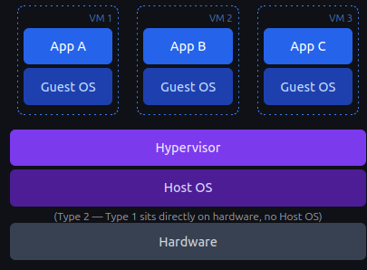
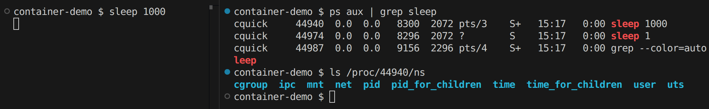

---
theme:
  override:
    code:
      alignment: left
      background: true
title: "Building a Minimal, Rootless Container in Rust"
author: Carlo Quick
---
bento
===

<!-- end_slide -->
Talk Goal
===
<!-- font_size: 2 -->
- Clear mental model of container fundamentals
- Rust tools to build your own
- Understanding of how Rust makes working with the linux kernel more approachable

<!-- end_slide -->
isolation
===
<!-- column_layout: [1, 1] -->
<!-- pause -->
<!-- column: 0 -->

<!-- font_size: 2 -->
* **Virtual Machines**: machine-level isolation.
<!-- pause -->
<!-- column: 1 -->

* **Containers**: process-level isolation.

<!-- end_slide -->
Namespaces and Cgroups
===

<!-- column_layout: [1, 1] -->
<!-- column: 0 -->
<!-- pause -->
<!-- font_size: 2 -->
# Namespaces

- control what a process can **see**.

<!-- pause -->
<!-- column: 1 -->

# Cgroups
- control what a process can **use**.

<!-- pause -->
<!-- reset_layout -->
<!-- new_lines: 2 -->
**Namespaces** give a process its own view of things like PIDs, hostnames, and filesystems. **Cgroups** keep it from eating all your CPU and memory.

Today, we're focusing entirely on **namespaces**. Cgroups are important — but that's a whole other talk.
<!-- end_slide -->

Namespaces
===
# Each process has a /proc/[pid]/ns subdirectory its namespaces.
* PID
* Network (network stack)
* Mount (fs mount point)
* UTS (hostname and system identifier)
* IPC (inter-process communication)
* User (user and group id)
* Cgroup
<!-- alignment: center -->


<!-- end_slide -->
<!-- skip_slide -->
Namespaces
===
<!-- alignment: center -->
| Namespace | Flag | Page | Isolates | 
|:---|:---|:---|:---|
| Cgroup |CLONE_NEWCGROUP |cgroup_namespaces(7) |  Cgroup root directory |
| IPC | CLONE_NEWIPC | ipc_namespaces(7) |System V IPC, POSIX message queues |
| Network | CLONE_NEWNET | network_namespaces(7) | Network devices,stacks,ports, etc. |
| Mount | CLONE_NEWNS | mount_namespaces(7) | Mount points |
| PID | CLONE_NEWPID | pid_namespaces(7) | Process IDs |
| Time | CLONE_NEWTIME | time_namespaces(7) | Boot and monotonic clocks |
| User | CLONE_NEWUSER | user_namespaces(7) | User and group IDs |
| UTS | CLONE_NEWUTS | uts_namespaces(7) | Hostname and NIS domain name |


<!-- end_slide -->
<!-- skip_slide -->
Container vs Host's Perspective
===
<!-- column_layout: [1, 1] -->
<!-- column: 0 -->
<!-- alignment: center -->
<!-- font_size: 2 -->
**Container's View**

"I'm the whole machine"

* PID:  1
👑 I am alone!


<!-- column: 1 -->
<!-- alignment: center -->
**Host's View**

* PID 1     systemd
* PID 435   sshd
* PID 1200  nginx
* PID 4812  "container"  ←
* PID 4999  postgres
...

<!-- end_slide -->
the root problem
===
<!--font_size: 2 -->
A **container** is process with a restricted view of the system.
<!-- alignment: center -->
🤔
<!-- reset_layout -->
<!-- pause -->
What privileges does that process actually have?
<!-- pause -->


<!-- end_slide -->
Rootless Containers
===
<!--font_size: 2 -->
Rootless containers are created by underprivileged users. Reduced blast radius if the process breaks isolation.


<!-- end_slide -->

Rust + exploring Linux kernel = ❤️
===
<!-- font_size: 2 -->
<!-- pause -->
# Rust doesn't invent new container primitives. It doesn't replace syscalls.

🦀
<!-- pause -->
# It gives you **compiler-enforced honesty**!
<!-- pause -->
* Fallible operation returns a `Result`
* Unsafe operation is explicitly marked
* Boundaries between safe and dangerous are **visible in the code**

The language refuses to let you gloss over the hard parts.
<!-- end_slide -->

fork(): C vs. Rust
===
* `fork()` creates a new process by duplicating the calling process. The new process is referred to as the child process.
<!-- column_layout: [1, 1] -->
<!-- column: 0 -->
```c
// C — fork(2)
pid = fork();
switch (pid) {
    case -1:
        perror("fork");
        exit(EXIT_FAILURE);
    case 0:
        puts("Child exiting.");
        _exit(EXIT_SUCCESS);
    default:
        printf("Child is PID %jd\n",
               (intmax_t) pid);
        exit(EXIT_SUCCESS);
}
```
<!-- column: 1 -->
```rust
// Rust — nix::unistd::fork
match unsafe { fork() } {
    Ok(Parent { child, .. }) => {
        println!("Child PID {}", child);
        waitpid(child, None)?;
    }
    Ok(Child) => {
        write(stdout(),
        b"Child process\n").ok();
        unsafe { libc::_exit(0) };
    }
    Err(_) => bail!("Fork failed."),
}
```
<!-- end_slide -->
The Tools (nix crate)
===

The **nix** crate wraps low-level libc calls in idiomatic Rust — not by hiding danger, but by making it explicit in the type system.

<!-- pause -->
**_https://github.com/nix-rust/nix_**

<!-- column_layout: [1, 1] -->
<!-- column: 0 -->

**libc**

```c
// unsafe, manual errno handling
pub unsafe extern fn gethostname(
    name: *mut c_char,
    len: size_t
) -> c_int;
```

<!-- column: 1 -->

**nix**

```rust
// returns Result<OsString>
pub fn gethostname() -> Result<OsString>;
```

<!-- reset_layout -->

<!-- pause -->

The kernel is still the kernel. But the **boundary is visible**: this can fail, and you must handle it.

<!-- pause -->

Let's start building.

<!-- end_slide -->
Guided Build
===
> **Note**: This demonstration linux kernel specific. I will share the slides and github link at the end of the presentation if anyone would like to try it themselves. Remember, though, you'll need to be on a linux machine, linux vm, use wsl2, or in container with special privileges.

These Are the only dependencies, that we'll need!

```toml
[dependencies]
anyhow = "1.0.100"
nix = { version = "0.30.1", features = ["sched", "feature", "fs", "mount", "process", "hostname", "signal","user"] }
```

The hardened kernel in Ubuntu 23.10+ restricts unprivileged user namespaces via AppArmor. When trying to make your container rootless, the kernel will prevent it. Follow this post to learn more about it.
running `echo 0 | sudo tee /proc/sys/kernel/apparmor_restrict_unprivileged_userns` will allow modifying user namespaces until the next system restart.

[AppArmor: Restrict Unprivileged User Namespaces](https://ubuntu.com/blog/ubuntu-23-10-restricted-unprivileged-user-namespaces)

<!-- end_slide -->

Printing Process Information
===

```rust
use nix::unistd::{ getcwd, gethostname, getpid, getuid };
fn print_proc_info(label: &str) -> Result<()> {
    eprintln!("[{}]", label);
    eprintln!(
        "uid [{}]\n\thostname [{:?}]  \n\tpid [{}] \n\tcwd [{:?}]",
        getuid(),
        gethostname()?,
        getpid(),
        getcwd()?,
    );
    Ok(())
}
```

For the sake of simplicity, I won't be showing this print function, but it works behind the scenes to provide an accurate view of the process' current state.

<!-- end_slide -->
Process Baseline
===
<!-- column_layout: [1, 1] -->


<!-- column: 0 -->
```rust +exec:rust-script +id:process_baseline
# //! ```cargo
# //! [dependencies]
# //! anyhow = "1.0.100"
# //! nix = { version = "0.30.1", features = ["sched", "fs", "mount", "process", "hostname", "signal","user"] }
# //! ```
# use anyhow::Result;
# use nix::unistd::{ getcwd, gethostname, getpid, getuid };
# fn print_proc_info(label: &str) -> Result<()> {
#    eprintln!("[{}]", label);
#    eprintln!(
#        "uid [{}]\n\thostname [{:?}]  \n\tpid [{}] \n\tcwd [{:?}]",
#        getuid(),
#        gethostname()?,
#        getpid(),
#        getcwd()?,
#    );
#    Ok(())
# }
fn main() -> Result<()> {
    print_proc_info("Before Isolation")?;
    Ok(())
}
```
<!-- column: 1 -->
<!-- snippet_output: process_baseline -->