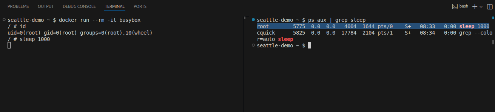

<!-- font_size: 4 -->
Rootless Containers
===
<!-- font_size: 2 -->
Rootless containers flip the model:

<!-- pause -->

Instead of **maximum privilege + containment**, start as an **unprivileged user** and selectively add isolation.

<!-- alignment: center -->

  | Traditional |Rootless |
  | -- | -- |
  | Start as root| Start as user |
 | Add restrictions     |   Add isolation |
 | Hope nothing escapes |   Limited blast radius |

<!-- end_slide -->
<!-- font_size: 4 -->
Rootless Containers pt.2
===
<!-- font_size: 2 -->
This is a **design choice**.

For example:

- **Podman** — rootless by default
- **Docker** — supports rootless, requires configuration

<!-- end_slide -->
