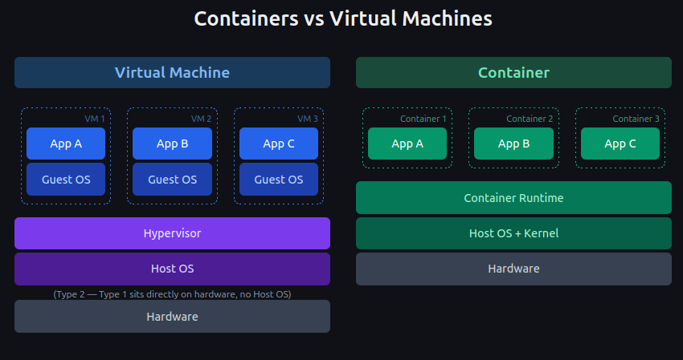
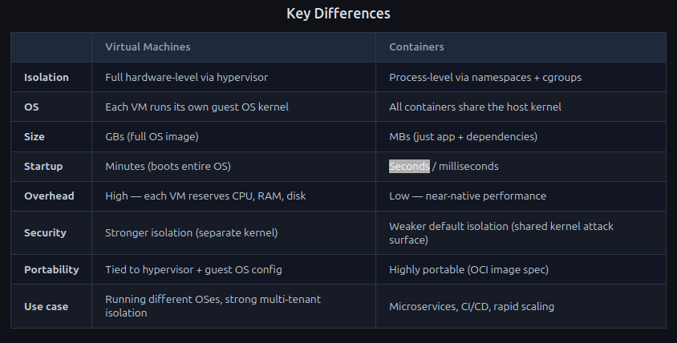

<!-- font_size: 4 -->
VMs vs Containers
===

**Virtual Machines** = hardware isolation.
**Containers** = process isolation.

<!-- font_size: 2 -->
<!-- alignment: center -->
# How Does Linux Pull This Off?
<!-- reset_layout -->
<!-- end_slide -->
<!-- reset_layout -->
